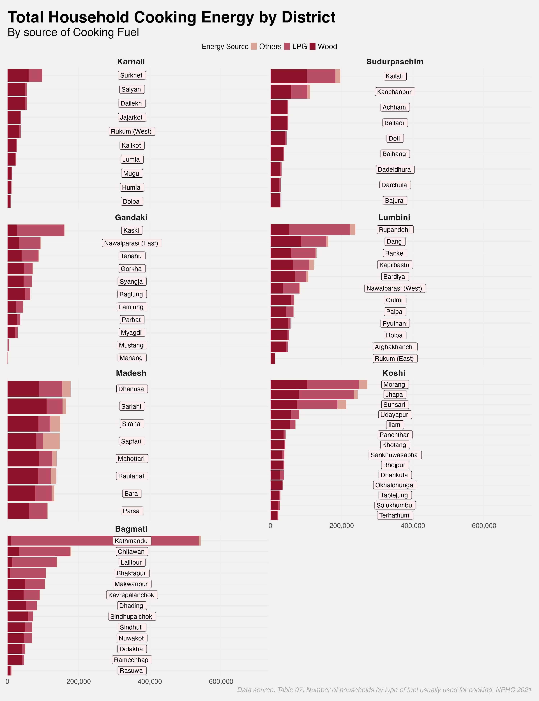

```{r}
#| label: Setup
#| echo: false
#| eval: true

#Setup----

library(tidyverse)
library(knitr)
library(kableExtra)
library(scales)

#Themes----
mytable_theme <- function(table,
                          caption = NULL,
                          footnote_text = NULL)
  table |>
   mutate(
      across(
        where(is.numeric),
        ~ ifelse(.x == 0, "-", .x)
      )
    ) |>
    kbl(
      caption = caption,
      align = c('l', rep('c', ncol(table) - 1)),
      booktabs = TRUE,
      longtable = TRUE
    ) |>
    kable_styling(
      position = "center",
      latex_options = "hold_position"
    ) |>
    row_spec(0, bold = TRUE, background = "#2E86AB", color = "#F2F0EF") |>
    column_spec(1, bold = TRUE, background = "#F2F0EF", color = "#2E86AB") |>
    footnote(
      general = footnote_text,
      footnote_as_chunk = TRUE,
      escape = FALSE,
      general_title = ""
    )

#Functions----
classify_local <- function(data) {
  data |>
    mutate(
      Local_type = case_when(
        str_detect(Local_level, "Gaunp") ~ "Gaunpalika",
        str_detect(Local_level, "Munici") ~ "Municipality",
        str_detect(Local_level, "Sub-Metro") ~ "Sub-Metropolitian City",
        str_detect(Local_level, "Metro") ~ "Metropolitian City",
        TRUE ~ "Other"
      )
    )
}

fuel_summary <- function(data, group_var, include_province = FALSE) {
  if (include_province) {
    data |>
      classify_local() |>
      group_by(Province, {{ group_var }}, Local_type) |>
      summarise(
        across(c(Wood, LPG, Others), sum),
        .groups = "drop"
      ) |>
      arrange(
        Province, {{ group_var }},
        match(Local_type, c("Metropolitian City", "Sub-Metropolitian City", "Municipality", "Gaunpalika"))
      )
  } else {
  data |>
    classify_local() |>
    group_by({{ group_var }}, Local_type) |>
    summarise(
      across(c(Wood, LPG, Others), sum),
      .groups = "drop"
    ) |>
    arrange(
      {{ group_var }},
      match(Local_type, c("Metropolitian City", "Sub-Metropolitian City", "Municipality", "Gaunpalika"))
    )
  }
}

count_local <- function(data, group_var, include_province = FALSE) {
  if (include_province) {
    data |>
      classify_local() |>
      distinct(Province, {{ group_var }}, Local_level, Local_type) |>
      count(Province, {{ group_var }}, Local_type) |>
      pivot_wider(names_from = Local_type, values_from = n, values_fill = 0) |>
      select(
        Province, {{ group_var }},
        any_of(c("Gaunpalika", "Municipality", "Sub-Metropolitian City", "Metropolitian City"))
      ) |>
      arrange(Province, {{ group_var }})
  } else {
    data |>
      classify_local() |>
      distinct({{ group_var }}, Local_level, Local_type) |>
      count({{ group_var }}, Local_type) |>
      pivot_wider(names_from = Local_type, values_from = n, values_fill = 0) |>
      select(
        {{ group_var }},
        any_of(c("Gaunpalika", "Municipality", "Sub-Metropolitian City", "Metropolitian City"))
      )
  }
}

fuel_table <- function(data, caption, group_col = 1, font = 8) {
  mytable_theme(
    data,
    caption = caption,
    footnote_text = "Source: Census 2021."
  ) |>
    kable_styling(
      latex_options = c("repeat_header", "scale_down"),
      font_size = font
    ) |>
    collapse_rows(columns = group_col, valign = "top")
}


# Data----
cooking <- read.csv('Cooking_fuel_NP.csv') |>
  mutate(
    Others = Electricity + Cow_dung + Bio_gas + Kerosene + Other
  ) |>
  select(Province, District, Local_level, Total, Wood, LPG, Others )


energy_source <- c("Wood", "LPG", "Others")
energy_colors <- c(Wood = "#890620", LPG = "#b6465f", Others = "#da9f93")

#Table prep----
fuel_district <- fuel_summary(cooking, District, include_province = TRUE)
fuel_state <- fuel_summary(cooking, Province)
count_dist <- count_local(cooking, District, include_province = TRUE)
count_prov <- count_local(cooking, Province)

province_order <- cooking |>
  group_by(Province) |>
  summarise(total = sum(Total)) |>
  arrange(total) |>
  pull(Province)

```

```{r}
#| label: fig-stacked
#| eval: true
#| fig-cap: "Total Household cooking energy by State"

energy_df_prov <- cooking |>
  select(Province, all_of(energy_source))

barplot_province <- aggregate(
  energy_df_prov[, energy_source],
  by = list(Province = energy_df_prov$Province),
  sum
) |>
  pivot_longer(
    cols = all_of(energy_source),
    names_to = "Source",
    values_to = "NumHouse"
  ) |>
  group_by(Province) |>
  mutate(total = sum(NumHouse)) |>
  ungroup() |>
  mutate(
    Province = factor(Province, levels = province_order),
    Source = fct_reorder(Source, NumHouse, sum)
  )

stacked <- barplot_province |>
  ggplot(aes(
    x = NumHouse,
    y = Province,
    fill = Source
  )) +
  geom_bar(
    width = 0.8,
    stat = "identity",
    position = "stack",
    alpha = 0.95
  ) +
  geom_text(
    data = distinct(barplot_province, Province, total),
    aes(
      x = 250000,
      y = Province,
      label = Province
    ),
    inherit.aes = FALSE,
    color = "#f6e8ea",
   size = 15,
    fontface = "bold"
  ) +
  scale_fill_manual(values = energy_colors) +
  scale_x_continuous(
    labels = scales::comma,
    expand = expansion(mult = c(0, 0))
  ) +
  labs(
    title = "Total Household Cooking Energy by State",
    subtitle = "By source of Cooking Fuel",
    fill = "Energy source",
    caption = "Data source: Table 07: Number of households by type of fuel usually used for cooking, NPHC 2021"
  ) +
  theme_minimal() +
  theme(
    plot.title = element_text(size = 50, hjust = 0, face = "bold", family = "sans"),
    plot.title.position = "plot",
    plot.subtitle = element_text(hjust = 0, size = 32, family = "sans"),
    plot.background = element_rect(fill = "#f2f2f2", color = NA),
    panel.grid.minor = element_blank(),
    axis.title = element_blank(),
    axis.text.y = element_blank(),
    axis.text.x = element_text(size = 20),
    axis.ticks.y = element_blank(),
    plot.caption.position = "plot",
    plot.caption = element_text(hjust = 1, size = 20, face = "italic", family = "times", color = 'darkgray'),
    legend.position = "bottom",
    legend.text = element_text(size = 32),
    legend.title = element_text(size = 32),
    plot.margin = margin(t = 30, r = 50, b = 20, l = 50, unit = "pt")
  )

ggsave("stacked.png", plot = stacked, width = 18, height = 14, dpi = 150)
```

```{r}
#| label: fig-stackeddist
#| fig-cap: "Total Household cooking energy by State"
#| echo: false
#| eval: true

energy_df_dist <- cooking |>
  select(Province, District, all_of(energy_source))

barplot_district <- aggregate(
    energy_df_dist[, energy_source],
    by = list(Province = energy_df_dist$Province, District = energy_df_dist$District),
    sum
  ) |>
  pivot_longer(
    cols = all_of(energy_source),
    names_to = "Source",
    values_to = "NumHouse"
  ) |>
  group_by(District) |>
  mutate(total = sum(NumHouse)) |>
  ungroup() |>
  mutate(
    Province = factor(Province, levels = province_order),
    District = fct_reorder(District, total),
    Source = fct_reorder(Source, NumHouse, sum),
    label_hjust = 1.20,
    label_color = "#f6e8ea"
  )

stacked_districts <- barplot_district |>
  ggplot(aes(x = NumHouse, y = District, fill = Source)) +
  geom_bar(stat = "identity", position = "stack", alpha = 0.95) +
  geom_label(
    data = distinct(barplot_district, District, Province, total,  
                    label_hjust, label_color),
aes(
  x = 350000,
  y = District,
  label = District),
size = 6,
fill = '#FAECEC',
color = 'black',
style = 'bold',
inherit.aes = FALSE
  ) +
  scale_color_identity() +
  scale_fill_manual(values = energy_colors) +
  scale_x_continuous(
    labels = scales::comma,
    expand = expansion(mult = c(0, 0.35))
  ) +
  facet_wrap(~ Province, scales = "free_y", ncol = 2) +
  labs(
    title  = "Total Household Cooking Energy by District",
    subtitle = "By source of Cooking Fuel",
    fill  = "Energy Source",
    caption = "Data source: Table 07: Number of households by type of fuel usually used for cooking, NPHC 2021"
  ) +
  theme_minimal() +
  theme(
    plot.title = element_text(size = 42, hjust = 0, face = "bold", family = "sans"),
    plot.title.position = "plot",
    plot.subtitle  = element_text(hjust = 0, size = 30, family = "sans"),
    plot.background = element_rect(fill = "#F2F0EF", color = NA),
    panel.grid.minor = element_blank(),
    axis.title  = element_blank(),
    axis.text.y = element_blank(),
    axis.text.x = element_text(size = 18),
    axis.ticks.y= element_blank(),
 plot.caption.position = "plot",
    plot.caption  = element_text(hjust = 1, face = "italic", family = "sans", size = 18, color= 'darkgray'),
    strip.text = element_text(hjust = 0.47, size = 22, face = "bold"),
legend.position = "top",
     legend.text = element_text(size = 20),
    legend.title = element_text(size = 19),
 plot.margin = margin(t = 30, r = 20, b = 20, l = 20, unit = "pt")
  )

ggsave("stacked_districts.png", plot = stacked_districts, width = 20, height = 26, dpi = 150)

```

```{r}

#| label: fig-stackedmuni
#| fig-cap: "Total Local levels by State"
#| echo: false
#| eval: true

local_colors <- c(
  "Gaunpalika" = "#2c2a4a",
  "Municipality"= "#4f518c",
  "Sub-Metropolitian City" = "#907ad6",
  "Metropolitian City" = "#dabfff"
)

province_order <- levels(barplot_province$Province)

barplot_loctype <- cooking |>
  classify_local() |>
  distinct(Province, Local_level, Local_type) |>
  count(Province, Local_type) |>
  group_by(Province) |>
  mutate(total = sum(n)) |>
  ungroup() |>
  mutate(
    Province = factor(Province, levels = province_order),
    Local_type = fct_reorder(Local_type, n, sum)
  )

stacked_loctype <- barplot_loctype |>
  ggplot(aes(x = n, y = Province, fill = Local_type)) +
  geom_bar(
    width = 0.8,
    stat = "identity",
    position = "stack",
    alpha = 0.95
  ) +
  geom_text(
    data = distinct(barplot_loctype, Province, total),
    aes(x = 45,
        y = Province,
        label = Province),
    inherit.aes = FALSE,
    color = "#f6e8ea",
    size = 15,
    fontface = "bold"
  ) +
  scale_fill_manual(values = local_colors) +
  scale_x_continuous(
    labels = scales::comma,
    expand = expansion(mult = c(0, 0.05))
  ) +
  labs(
    title = "Local Government Type Distribution by Province",
    subtitle = "Number of local levels by type",
    fill  = "Local Level Type",
    caption = "Source: NPHC 2021"
  ) +
  theme_minimal() +
  theme(
    plot.title = element_text(size = 50, hjust = 0, face = "bold", family = "sans"),
    plot.title.position = "plot",
    plot.subtitle = element_text(hjust = 0, size = 32, family = "sans"),
    plot.background = element_rect(fill = "#f2f2f2", color = NA),
    panel.grid.minor = element_blank(),
    axis.title = element_blank(),
    axis.text.y = element_blank(),
    axis.text.x = element_text(size = 20),
    axis.ticks.y = element_blank(),
    plot.caption.position = "plot",
    plot.caption = element_text(hjust = 1, size = 20, face = "italic", family = "times", color = 'darkgray'),
    legend.position = "bottom",
    legend.text = element_text(size = 30),
    legend.title = element_text(size = 30),
    plot.margin = margin(t = 30, r = 50, b = 20, l = 50, unit = "pt")
  )

ggsave("stacked_loctype.png", plot = stacked_loctype, width = 18, height = 14, dpi = 150)
```
# LPG dependence in Nepali Households as Recorded in 2021 Nepal Census.

## Summary
This report analyzes household cooking fuel use in Nepal using data from the 2021 National Population and Housing Census, with the intention of understanding the role of liquefied petroleum gas (LPG). This analysis shows that LPG has become the main cooking fuel in cities and towns, while wood remains dominant in rural areas. This pattern matters because Nepal imports all of its LPG and is therefore exposed to global supply disruptions. Recent instability around the Strait of Hormuz has contributed to shortages and price hikes that Nepali households are currently experiencing. By examining cooking fuel use across provinces, districts, and types of local governments, this report shows that dependence on LPG is highly uneven within Nepal. Urban areas benefit most from LPG, so they are also the most vulnerable when imports are disrupted.The findings highlight an important trade‑off between cleaner cooking and energy security in a net importer country like Nepal.

## Motivation

Over the past decade, Nepal has made progress in moving households away from traditional cooking fuels such as firewood, biogas, cow dung etc. and LPG has played a central role in this transition. However, Nepal does not produce LPG domestically and relies entirely on imports, mostly through regional supply chains connected to global energy markets. This dependence has cost household a large price along many crisis that the Nepali economy has faced, like the 2015 earthquake, India's economic blockage, Covid etc.; And now is even more visible during recent shortages and price increases linked to geopolitical tensions affecting the Strait of Hormuz. When supply routes are disrupted, Nepali households feel the effects almost immediately. Understanding how widespread LPG use is and where it is most concentrated, is important for energy planning and policy. National averages alone do not show which regions are most exposed to LPG shortages or which areas are less affected because they still rely on domestic fuels. This report aims to fill that gap by using detailed census data to map cooking fuel use across Nepal and assess the country’s vulnerability to LPG supply shocks.


## Data and Measurement
The analysis uses data from Nepal’s 2021 National Population and Housing Census, retrieved from [Government of Nepal, National Statistics Office](https://censusnepal.cbs.gov.np/results/population), which reports the number of households using different fuels for cooking. The fuels included in the dataset are Wood, LPG, Electricity, Bio gas, Cow dung, Kerosene, and Other sources. For visualization purpose, all sources except for the two big ones i.e. Wood and LPG, have been consolidated as 'Other sources'. The data are available at multiple levels, including province, district, and local government.

Local governments are grouped into four types, from most to least urban:

1. Metropolitan City 
1. Sub‑Metropolitan City 
1. Municipality
1. Gaunpalika (rural municipalities) 

```{r}
#| label: data-percentloc
#| echo: false
#| eval: true

fuel_percent <- fuel_summary(cooking, Province) |>
  group_by(Local_type) |>
  summarise(
    across(c(Wood, LPG, Others), sum),
    Total = sum(Wood, LPG, Others),
    .groups = "drop"
  ) |>
  mutate(
    National_total = sum(Total),
    National_Share = round((Total / National_total) * 100, 1),
    across(c(Wood, LPG, Others),
           ~ round(.x / Total * 100, 1)),
    across(
      -Local_type,
      ~ paste0(.x, "%")
    )
  ) |>
  select(
    Local_type, National_Share,
    Wood, LPG, Others
  ) |>
  arrange(match(Local_type,
                c("Metropolitian City",
                  "Sub-Metropolitian City",
                  "Municipality",
                  "Gaunpalika")))
```

```{r}
#| label: tbl-percentlocook
#| echo: false
#| eval: true
fuel_table(fuel_percent, "Percentage Distribution of Cooking Fuel by Local Level Type")
```

Nepal is politically divided into 7 states, that span cross 77 districts and account for 753 local levels. The four local level division are based on population size, urban/rural character, and administrative needs.

@tbl-percentlocook quantifies the distribution of cooking fuel use across these local government types. It shows that while metropolitan cities account for only 9.9% of households nationally, 91.6% of those households rely on LPG as their primary cooking fuel. In contrast, Gaunpalikas, which account for 32.8% of households, have only 18.9% LPG use and 75% reliance on wood. This stark difference highlights the strong association between urbanization and LPG adoption.

To capture both proportions and scale, this report combines percentage data (@tbl-percentlocook) with absolute household counts (@tbl-stateloc and @tbl-districtloc) and visualizations (Figures \ref{fig-stacked}, \ref{fig-stackedmuni} and @fig-stackeddist).

## Analysis

#### Cooking fuel use by province

```{=latex}
\begin{wrapfigure}[25]{R}{12 cm}
  \centering
  \includegraphics[width= 12 cm, height=10cm, keepaspectratio]{stacked.png}
  \caption{Cooking Energy by Province}
  \label{fig-stacked}
\end{wrapfigure}
```

Figure \ref{fig-stacked} shows substantial variation in cooking fuel use across Nepal’s provinces, driven largely by differences in urbanization. Provinces with larger urban populations show higher reliance on LPG, while more rural provinces remain dominated by wood.
Bagmati Province stands out as the most LPG-dependent region. @tbl-stateloc confirms this pattern, showing that metropolitan and sub-metropolitan areas in Bagmati account for over 430,000 LPG-using households, compared to fewer than 100,000 households using wood in those same urban areas.
However, this pattern reverses within rural parts of Bagmati. In Gaunpalikas, @tbl-stateloc shows that 272,337 households use wood compared to only 72,521 using LPG, indicating that wood use remains nearly four times higher in rural areas of the same province.
In contrast, provinces such as Karnali and Sudurpaschim are overwhelmingly dependent on wood. We see that in Karnali’s Gaunpalikas alone, 157,434 households rely on wood compared to just 8,898 households using LPG, indicating that the vast majority of rural households still rely on traditional fuels.
These differences demonstrate that national increases in LPG use are driven primarily by urban provinces rather than by uniform adoption across the country.


#### Differences within provinces
While provincial averages reveal broad trends, @fig-stackeddist highlights substantial variation within provinces at the district level. @tbl-districtloc indicates that 235,688 households use LPG in Kathmandu district’s metropolitan areas compared to only 511 households using wood, meaning LPG use exceeds wood use by more than 400 times.
In contrast, nearby districts such as Ramechhap and Sindhuli show the opposite pattern. The table shows that wood-using households exceed LPG users by more than a tenfold margin in these districts, reflecting much lower levels of urbanization and infrastructure access.
Similar disparities appear in other provinces. In Jhapa District (Koshi Province), we see strong LPG use in municipalities (123,904 households), while rural Gaunpalikas continue to have tens of thousands of wood-using households.
These patterns confirm that vulnerability to LPG shortages is highly localized, varying dramatically even within the same province.

#### Urban–rural divide

```{=latex}
\begin{wrapfigure}[25]{R}{12 cm}
  \centering
  \includegraphics[width= 12 cm, height=10cm, keepaspectratio]{stacked_loctype.png}
  \caption{Local level by province}
  \label{fig-stackedmuni}
\end{wrapfigure}
```

@tbl-percentlocook clearly demonstrates the national urban–rural divide in cooking fuel choice, while \ref{fig-stackedmuni} shows the share of urban and rural areas in each province based on local government types. This helps us contextualize urban-LPG and rural-wood pattern across provinces seen in \ref{fig-stacked}.
This pattern is consistent across provinces. For example, in Madesh Province, @tbl-stateloc shows that metropolitan areas have significantly higher LPG use, while Gaunpalikas have 195,522 wood-using households compared to only 51,992 LPG users, meaning wood use exceeds LPG by nearly four times.
Similarly, in Sudurpaschim, we see 183,206 households using wood compared to just 18,921 using LPG in Gaunpalikas, indicating extremely low LPG penetration.
These urban areas with LPG dependence are also the most densely populated areas.As a result, although rural areas rely more heavily on traditional fuels, the majority of LPG demand, and therefore exposure to import disruptions, is concentrated in cities and large municipalities.

## Discussion and Conclusion 
This analysis clarifies the core trade‑off in Nepal’s cooking energy transition. LPG adoption has delivered cleaner and faster cooking for urban households, where over 70% of municipal households and more than 90% of metropolitan households rely on LPG. However, this same concentration means that urban provinces such as Bagmati, Koshi, and Lumbini account for the bulk of national LPG consumption, despite representing a smaller share of total local governments.
Rural areas remain heavily dependent on wood, which reduces their exposure to global LPG price shocks but perpetuates health and environmental risks. For example, in Karnali and Sudurpaschim, over three‑quarters of households still cook with wood, making LPG shortages less disruptive in the short run but locking households into polluting fuels.
Overall, the data shows that Nepal’s vulnerability to LPG supply shocks is not proportional to population alone, but rather to urban concentration. Expanding alternatives such as electric cooking or biogas in metropolitan and municipal areas where LPG use exceeds wood by margins of 5:1 or more, could substantially reduce national exposure to imported LPG while preserving the gains from cleaner cooking.

# Thank you

# Appendix

```{r}
#| label: Setup1
#| echo: true
#| eval: false

#Setup----

library(tidyverse)
library(knitr)
library(kableExtra)
library(scales)

#Themes----
mytable_theme <- function(table,
                          caption = NULL,
                          footnote_text = NULL)
  table |>
   mutate(
      across(
        where(is.numeric),
        ~ ifelse(.x == 0, "-", .x)
      )
    ) |>
    kbl(
      caption = caption,
      align = c('l', rep('c', ncol(table) - 1)),
      booktabs = TRUE,
      longtable = TRUE
    ) |>
    kable_styling(
      position = "center",
      latex_options = "hold_position"
    ) |>
    row_spec(0, bold = TRUE, background = "#2E86AB", color = "#F2F0EF") |>
    column_spec(1, bold = TRUE, background = "#F2F0EF", color = "#2E86AB") |>
    footnote(
      general = footnote_text,
      footnote_as_chunk = TRUE,
      escape = FALSE,
      general_title = ""
    )

#Functions----
classify_local <- function(data) {
  data |>
    mutate(
      Local_type = case_when(
        str_detect(Local_level, "Gaunp") ~ "Gaunpalika",
        str_detect(Local_level, "Munici") ~ "Municipality",
        str_detect(Local_level, "Sub-Metro") ~ "Sub-Metropolitian City",
        str_detect(Local_level, "Metro") ~ "Metropolitian City",
        TRUE ~ "Other"
      )
    )
}

fuel_summary <- function(data, group_var, include_province = FALSE) {
  if (include_province) {
    data |>
      classify_local() |>
      group_by(Province, {{ group_var }}, Local_type) |>
      summarise(
        across(c(Wood, LPG, Others), sum),
        .groups = "drop"
      ) |>
      arrange(
        Province, {{ group_var }},
        match(Local_type, c("Metropolitian City", "Sub-Metropolitian City", "Municipality", "Gaunpalika"))
      )
  } else {
  data |>
    classify_local() |>
    group_by({{ group_var }}, Local_type) |>
    summarise(
      across(c(Wood, LPG, Others), sum),
      .groups = "drop"
    ) |>
    arrange(
      {{ group_var }},
      match(Local_type, c("Metropolitian City", "Sub-Metropolitian City", "Municipality", "Gaunpalika"))
    )
  }
}

count_local <- function(data, group_var, include_province = FALSE) {
  if (include_province) {
    data |>
      classify_local() |>
      distinct(Province, {{ group_var }}, Local_level, Local_type) |>
      count(Province, {{ group_var }}, Local_type) |>
      pivot_wider(names_from = Local_type, values_from = n, values_fill = 0) |>
      select(
        Province, {{ group_var }},
        any_of(c("Gaunpalika", "Municipality", "Sub-Metropolitian City", "Metropolitian City"))
      ) |>
      arrange(Province, {{ group_var }})
  } else {
    data |>
      classify_local() |>
      distinct({{ group_var }}, Local_level, Local_type) |>
      count({{ group_var }}, Local_type) |>
      pivot_wider(names_from = Local_type, values_from = n, values_fill = 0) |>
      select(
        {{ group_var }},
        any_of(c("Gaunpalika", "Municipality", "Sub-Metropolitian City", "Metropolitian City"))
      )
  }
}

fuel_table <- function(data, caption, group_col = 1, font = 8) {
  mytable_theme(
    data,
    caption = caption,
    footnote_text = "Source: Census 2021."
  ) |>
    kable_styling(
      latex_options = c("repeat_header", "scale_down"),
      font_size = font
    ) |>
    collapse_rows(columns = group_col, valign = "top")
}


# Data----
cooking <- read.csv('Cooking_fuel_NP.csv') |>
  mutate(
    Others = Electricity + Cow_dung + Bio_gas + Kerosene + Other
  ) |>
  select(Province, District, Local_level, Total, Wood, LPG, Others )


energy_source <- c("Wood", "LPG", "Others")
energy_colors <- c(Wood = "#890620", LPG = "#b6465f", Others = "#da9f93")

#Table prep----
fuel_district <- fuel_summary(cooking, District, include_province = TRUE)
fuel_state <- fuel_summary(cooking, Province)
count_dist <- count_local(cooking, District, include_province = TRUE)
count_prov <- count_local(cooking, Province)

province_order <- cooking |>
  group_by(Province) |>
  summarise(total = sum(Total)) |>
  arrange(total) |>
  pull(Province)

```

```{r}
#| label: fig-stacked1
#| echo: true
#| eval: false
#| fig-cap: "Total Household cooking energy by State"

energy_df_prov <- cooking |>
  select(Province, all_of(energy_source))

barplot_province <- aggregate(
  energy_df_prov[, energy_source],
  by = list(Province = energy_df_prov$Province),
  sum
) |>
  pivot_longer(
    cols = all_of(energy_source),
    names_to = "Source",
    values_to = "NumHouse"
  ) |>
  group_by(Province) |>
  mutate(total = sum(NumHouse)) |>
  ungroup() |>
  mutate(
    Province = factor(Province, levels = province_order),
    Source = fct_reorder(Source, NumHouse, sum)
  )

stacked <- barplot_province |>
  ggplot(aes(
    x = NumHouse,
    y = Province,
    fill = Source
  )) +
  geom_bar(
    width = 0.8,
    stat = "identity",
    position = "stack",
    alpha = 0.95
  ) +
  geom_text(
    data = distinct(barplot_province, Province, total),
    aes(
      x = 250000,
      y = Province,
      label = Province
    ),
    inherit.aes = FALSE,
    color = "#f6e8ea",
   size = 15,
    fontface = "bold"
  ) +
  scale_fill_manual(values = energy_colors) +
  scale_x_continuous(
    labels = scales::comma,
    expand = expansion(mult = c(0, 0))
  ) +
  labs(
    title = "Total Household Cooking Energy by State",
    subtitle = "By source of Cooking Fuel",
    fill = "Energy source",
    caption = "Data source: Table 07: Number of households by type of fuel usually used for cooking, NPHC 2021"
  ) +
  theme_minimal() +
  theme(
    plot.title = element_text(size = 50, hjust = 0, face = "bold", family = "sans"),
    plot.title.position = "plot",
    plot.subtitle = element_text(hjust = 0, size = 32, family = "sans"),
    plot.background = element_rect(fill = "#f2f2f2", color = NA),
    panel.grid.minor = element_blank(),
    axis.title = element_blank(),
    axis.text.y = element_blank(),
    axis.text.x = element_text(size = 20),
    axis.ticks.y = element_blank(),
    plot.caption.position = "plot",
    plot.caption = element_text(hjust = 1, size = 20, face = "italic", family = "times", color = 'darkgray'),
    legend.position = "bottom",
    legend.text = element_text(size = 32),
    legend.title = element_text(size = 32),
    plot.margin = margin(t = 30, r = 50, b = 20, l = 50, unit = "pt")
  )

ggsave("stacked.png", plot = stacked, width = 18, height = 14, dpi = 150)
```

```{r}

#| label: fig-stackedmuni1
#| echo: true
#| eval: false
#| fig-cap: "Total Local levels by State"

local_colors <- c(
  "Gaunpalika" = "#2c2a4a",
  "Municipality"= "#4f518c",
  "Sub-Metropolitian City" = "#907ad6",
  "Metropolitian City" = "#dabfff"
)

province_order <- levels(barplot_province$Province)

barplot_loctype <- cooking |>
  classify_local() |>
  distinct(Province, Local_level, Local_type) |>
  count(Province, Local_type) |>
  group_by(Province) |>
  mutate(total = sum(n)) |>
  ungroup() |>
  mutate(
    Province = factor(Province, levels = province_order),
    Local_type = fct_reorder(Local_type, n, sum)
  )

stacked_loctype <- barplot_loctype |>
  ggplot(aes(x = n, y = Province, fill = Local_type)) +
  geom_bar(
    width = 0.8,
    stat = "identity",
    position = "stack",
    alpha = 0.95
  ) +
  geom_text(
    data = distinct(barplot_loctype, Province, total),
    aes(x = 45,
        y = Province,
        label = Province),
    inherit.aes = FALSE,
    color = "#f6e8ea",
    size = 15,
    fontface = "bold"
  ) +
  scale_fill_manual(values = local_colors) +
  scale_x_continuous(
    labels = scales::comma,
    expand = expansion(mult = c(0, 0.05))
  ) +
  labs(
    title = "Local Government Type Distribution by Province",
    subtitle = "Number of local levels by type",
    fill  = "Local Level Type",
    caption = "Source: NPHC 2021"
  ) +
  theme_minimal() +
  theme(
    plot.title = element_text(size = 50, hjust = 0, face = "bold", family = "sans"),
    plot.title.position = "plot",
    plot.subtitle = element_text(hjust = 0, size = 32, family = "sans"),
    plot.background = element_rect(fill = "#f2f2f2", color = NA),
    panel.grid.minor = element_blank(),
    axis.title = element_blank(),
    axis.text.y = element_blank(),
    axis.text.x = element_text(size = 20),
    axis.ticks.y = element_blank(),
    plot.caption.position = "plot",
    plot.caption = element_text(hjust = 1, size = 20, face = "italic", family = "times", color = 'darkgray'),
    legend.position = "bottom",
    legend.text = element_text(size = 30),
    legend.title = element_text(size = 30),
    plot.margin = margin(t = 30, r = 50, b = 20, l = 50, unit = "pt")
  )

ggsave("stacked_loctype.png", plot = stacked_loctype, width = 18, height = 14, dpi = 150)
```

```{r}
#| label: fig-stackeddist1
#| echo: true
#| eval: false
#| fig-cap: "Total Household cooking energy by State"

energy_df_dist <- cooking |>
  select(Province, District, all_of(energy_source))

barplot_district <- aggregate(
    energy_df_dist[, energy_source],
    by = list(Province = energy_df_dist$Province, District = energy_df_dist$District),
    sum
  ) |>
  pivot_longer(
    cols = all_of(energy_source),
    names_to = "Source",
    values_to = "NumHouse"
  ) |>
  group_by(District) |>
  mutate(total = sum(NumHouse)) |>
  ungroup() |>
  mutate(
    Province = factor(Province, levels = province_order),
    District = fct_reorder(District, total),
    Source = fct_reorder(Source, NumHouse, sum),
    label_hjust = 1.20,
    label_color = "#f6e8ea"
  )

stacked_districts <- barplot_district |>
  ggplot(aes(x = NumHouse, y = District, fill = Source)) +
  geom_bar(stat = "identity", position = "stack", alpha = 0.95) +
  geom_label(
    data = distinct(barplot_district, District, Province, total,  
                    label_hjust, label_color),
aes(
  x = 350000,
  y = District,
  label = District),
size = 6,
fill = '#FAECEC',
color = 'black',
style = 'bold',
inherit.aes = FALSE
  ) +
  scale_color_identity() +
  scale_fill_manual(values = energy_colors) +
  scale_x_continuous(
    labels = scales::comma,
    expand = expansion(mult = c(0, 0.35))
  ) +
  facet_wrap(~ Province, scales = "free_y", ncol = 2) +
  labs(
    title  = "Total Household Cooking Energy by District",
    subtitle = "By source of Cooking Fuel",
    fill  = "Energy Source",
    caption = "Data source: Table 07: Number of households by type of fuel usually used for cooking, NPHC 2021"
  ) +
  theme_minimal() +
  theme(
    plot.title = element_text(size = 42, hjust = 0, face = "bold", family = "sans"),
    plot.title.position = "plot",
    plot.subtitle  = element_text(hjust = 0, size = 30, family = "sans"),
    plot.background = element_rect(fill = "#F2F0EF", color = NA),
    panel.grid.minor = element_blank(),
    axis.title  = element_blank(),
    axis.text.y = element_blank(),
    axis.text.x = element_text(size = 18),
    axis.ticks.y= element_blank(),
 plot.caption.position = "plot",
    plot.caption  = element_text(hjust = 1, face = "italic", family = "sans", size = 18, color= 'darkgray'),
    strip.text = element_text(hjust = 0.47, size = 22, face = "bold"),
legend.position = "top",
     legend.text = element_text(size = 20),
    legend.title = element_text(size = 19),
 plot.margin = margin(t = 30, r = 20, b = 20, l = 20, unit = "pt")
  )

ggsave("stacked_districts.png", plot = stacked_districts, width = 20, height = 26, dpi = 150)

```


```{r}
#| label: tbl-stateloc
#| echo: true
#| eval: true
#| tbl-cap: "Cooking Fuel by Local Level Type per State"

fuel_table(fuel_state, "Cooking Fuel by Local Level Type per State", font = 7)
```

```{r}
#| label: data-percentloc1
#| echo: true
#| eval: false

fuel_percent <- fuel_summary(cooking, Province) |>
  group_by(Local_type) |>
  summarise(
    across(c(Wood, LPG, Others), sum),
    Total = sum(Wood, LPG, Others),
    .groups = "drop"
  ) |>
  mutate(
    National_total = sum(Total),
    National_Share = round((Total / National_total) * 100, 1),
    across(c(Wood, LPG, Others),
           ~ round(.x / Total * 100, 1)),
    across(
      -Local_type,
      ~ paste0(.x, "%")
    )
  ) |>
  select(
    Local_type, National_Share,
    Wood, LPG, Others
  ) |>
  arrange(match(Local_type,
                c("Metropolitian City",
                  "Sub-Metropolitian City",
                  "Municipality",
                  "Gaunpalika")))
```

```{r}
#| label: table-percentlocook1
#| echo: true
#| eval: false
fuel_table(fuel_percent, "Percentage Distribution of Cooking Fuel by Local Level Type")
```


```{r}
#| label: tbl-districtloc
#| echo: true
#| eval: true
#| tbl-cap: "Cooking Fuel by Local Level Type per District"

fuel_table(fuel_district, "Cooking Fuel by Local Level Type per District",
           group_col = c(1,2),
           font = 7)
  
```

{#fig-stackeddist}


